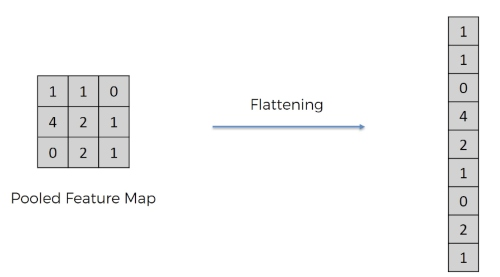
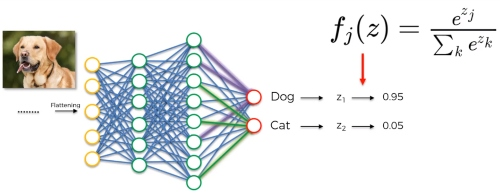
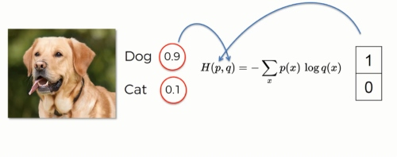
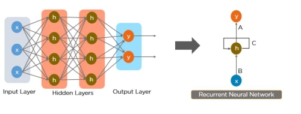

### Artificial Neural Network (ANN)?

Artificial neural network (ANN) is a computational model that consists of several processing elements that receive inputs and deliver outputs based on their predefined activation functions.

#### Activation Function:

There are four types of activation function.

1. Threshold function:

    The output is set at one of two levels, depending on whether the total input is greater than or less than some threshold value.

    

2. Sigmoid function:

    The values of logistic function range from 0 and 1 

    

3. Rectifier  Function:

    

4. Hyperbolic tangent function:

    

[Types of activation functions][1]

[1]:https://www.v7labs.com/blog/neural-networks-activation-functions "activation functions"

#### What is a loss/Cost function?

‘Loss’ in Machine learning helps us understand the difference between the predicted value & the actual value. The Function used to quantify this loss during the training phase in the form of a single real number is known as “Loss Function”. These are used in those supervised learning algorithms that use optimization techniques. Notable examples of such algorithms are regression, logistic regression, etc. The terms cost function & loss function are analogous.

Loss function:  Used when we refer to the error for a single training example.

Cost function: Used to refer to an average of the loss functions over an entire training dataset.

[Cost function is no rocket science!][2]

[2]:https://www.analyticsvidhya.com/blog/2021/02/cost-function-is-no-rocket-science/

#### What is Backpropagation?

Backpropagation is the essence of neural network training. It is the method of fine-tuning the weights of a neural network based on the error rate obtained in the previous epoch (i.e., iteration). Proper tuning of the weights allows you to reduce error rates and make the model reliable by increasing its generalization.

[How Does Back-Propagation in Artificial Neural Networks Work?][3]

[How the backpropagation algorithm works][4]

[3]:https://towardsdatascience.com/how-does-back-propagation-in-artificial-neural-networks-work-c7cad873ea7
[4]:http://neuralnetworksanddeeplearning.com/chap2.html

#### What is Gradiant descent?

Gradient Descent is an optimization algorithm for finding a local minimum of a differentiable function. Gradient descent is simply used in machine learning to find the values of a function's parameters (coefficients) that minimize a cost function as far as possible.

"A gradient measures how much the output of a function changes if you change the inputs a little bit." — Lex Fridman (MIT)

[Gradiant Descent][5]

[5]:https://builtin.com/data-science/gradient-descent

Types of Gradient Descent

There are three popular types of gradient descent that mainly differ in the amount of data they use: 

* Batch Gradient Descent

    Batch gradient descent, also called vanilla gradient descent, calculates the error for each example within the training dataset, but only after all training examples have been evaluated does the model get updated. This whole process is like a cycle and it's called a training epoch.

    Some advantages of batch gradient descent are its computational efficient, it produces a stable error gradient and a stable convergence. Some disadvantages are the stable error gradient can sometimes result in a state of convergence that isn’t the best the model can achieve. It also requires the entire training dataset be in memory and available to the algorithm.

* Stochastic gradient descent

    By contrast, stochastic gradient descent (SGD) does this for each training example within the dataset, meaning it updates the parameters for each training example one by one. Depending on the problem, this can make SGD faster than batch gradient descent. One advantage is the frequent updates allow us to have a pretty detailed rate of improvement.

    The frequent updates, however, are more computationally expensive than the batch gradient descent approach. Additionally, the frequency of those updates can result in noisy gradients, which may cause the error rate to jump around instead of slowly decreasing.

* Mini-batch gradient descent

    Mini-batch gradient descent is the go-to method since it’s a combination of the concepts of SGD and batch gradient descent. It simply splits the training dataset into small batches and performs an update for each of those batches. This creates a balance between the robustness of stochastic gradient descent and the efficiency of batch gradient descent.

### Convolutional Neural Network

A Convolutional Neural Network (ConvNet/CNN) is a Deep Learning algorithm which can take in an input image, assign importance (learnable weights and biases) to various aspects/objects in the image and be able to differentiate one from the other. The pre-processing required in a ConvNet is much lower as compared to other classification algorithms. While in primitive methods filters are hand-engineered, with enough training, ConvNets have the ability to learn these filters/characteristics.

The architecture of a ConvNet is analogous to that of the connectivity pattern of Neurons in the Human Brain and was inspired by the organization of the Visual Cortex. Individual neurons respond to stimuli only in a restricted region of the visual field known as the Receptive Field. A collection of such fields overlap to cover the entire visual area.

[Why CNN?][7]

[CNN Cheat Sheet][6]

[6]:https://stanford.edu/~shervine/teaching/cs-230/cheatsheet-convolutional-neural-networks "cnn cheat sheet"
[7]:https://towardsdatascience.com/simple-introduction-to-convolutional-neural-networks-cdf8d3077bac "why cnn?"

#### Types of layer in CNN

* #### Convolution Layer

    Convolutional layers are the major building blocks used in convolutional neural networks.

    A convolution is the simple application of a filter to an input that results in an activation. Repeated application of the same filter to an input results in a map of activations called a feature map, indicating the locations and strength of a detected feature in an input, such as an image.

    

    [What is convolution layer?][8]

    [8]:https://analyticsindiamag.com/what-is-a-convolutional-layer/ "What is convolution layer?"

    #### Relu layer

    The Rectified Linear Unit, or ReLU, is not a separate component of the convolutional neural networks' process.It's a supplementary step to the convolution operation.

    In this layer we remove every negative value from the filtered image and replace it with zero. This function only activates when the node input is above a certain quantity. So, when the input is below zero the output is zero. However, when the input rises above a certain threshold it has linear relationship with the dependent variable. This means that it is able to accelerate the speed of a training data set in a deep neural network that is faster than other activation functions – this is done to avoid summing up with zero.

    

    [Convolutional Neural Networks (CNN): Step 1(b) - ReLU Layer][9]

    [9]:https://www.superdatascience.com/blogs/convolutional-neural-networks-cnn-step-1b-relu-layer "relu layer1"

    [How ReLU and Dropout Layers Work in CNNs?][10]

    [10]:https://www.baeldung.com/cs/ml-relu-dropout-layers "relu_layer2"

* #### Pooling Layer
    A pooling layer is another building block of a CNN.

    Its function is to progressively reduce the spatial size of the representation to reduce the amount of parameters and computation in the network. Pooling layer operates on each feature map independently.

    The most common approach used in pooling is max pooling.

    

    [Comprehensive Guide to Different Pooling Layers in Deep Learning][11]

    [Convolutional Neural Networks (CNN): Step 2 - Max Pooling][12]

    [11]:https://analyticsindiamag.com/comprehensive-guide-to-different-pooling-layers-in-deep-learning/ "pooling1"
    [12]:https://www.superdatascience.com/blogs/convolutional-neural-networks-cnn-step-2-max-pooling/ "pooling2"

* #### Flattening Step
    The flattening step is a refreshingly simple step involved in building a convolutional neural network.

    It involves taking the pooled feature map that is generated in the pooling step and transforming it into a one-dimensional vector. Here is a visual representation of what this process looks like:

    

    [Convolutional Neural Networks (CNN): Step 3 - Flattening][13]

    [13]:https://www.superdatascience.com/blogs/convolutional-neural-networks-cnn-step-3-flattening "flattening"

* #### Fully Connected Layer

    Fully Connected Layer is simply, feed forward neural networks. Fully Connected Layers form the last few layers in the network.

    The input to the fully connected layer is the output from the final Pooling or Convolutional Layer, which is flattened and then fed into the fully connected layer.

    

    [Convolutional Neural Networks (CNN): Step 4 - Full Connection][14]

    [14]:https://www.superdatascience.com/blogs/convolutional-neural-networks-cnn-step-4-full-connection "f_c_layer"

* #### Output layer
    #### Softmax Function
    Softmax is an activation function that scales numbers/logits into probabilities.It is popularly used for multiclass classification problems. In the Output layer we are going to use softmax layer to efficiently calculate the dependent probability of each output or class.

    
    
    [Softmax Activation Function — How It Actually Works][15]

    [15]:https://towardsdatascience.com/softmax-activation-function-how-it-actually-works-d292d335bd78 "softmax"

    #### Cross-Entropy
    Hand in hand with the softmax function is the cross-entropy loss function.

    

    [Cross-Entropy loss function][16]

    [16]:https://towardsdatascience.com/cross-entropy-loss-function-f38c4ec8643e

    [Cross-Entropy Demystified][18]

    [18]:https://towardsdatascience.com/cross-entropy-demystified-f0886a64883f

    [Softmax & Cross-Entropy][17]

    [17]:https://www.superdatascience.com/blogs/convolutional-neural-networks-cnn-softmax-crossentropy

### Recurrent Neural Network

Recurrent Neural Network, this is a type of artificial neural network that can process sequential data, recognize patterns and predict the final output.
This Neural Network is called Recurrent because it can repeatedly perform the same task or operation on a sequence of inputs.
An RNN has an internal memory that allows it to remember or memorize the information of the input it received and this helps the system to gain context. Therefore if you have sequential data like a time series, then an RNN will be a good fit to process that data. 
This can not be done by a CNN or Feed-Forward Neural Networks since they can not sort the correlation between previous input to the next input.

[A Guide to RNN: Understanding Recurrent Neural Networks and LSTM Networks][19]

[19]:https://builtin.com/data-science/recurrent-neural-networks-and-lstm "rnn"

